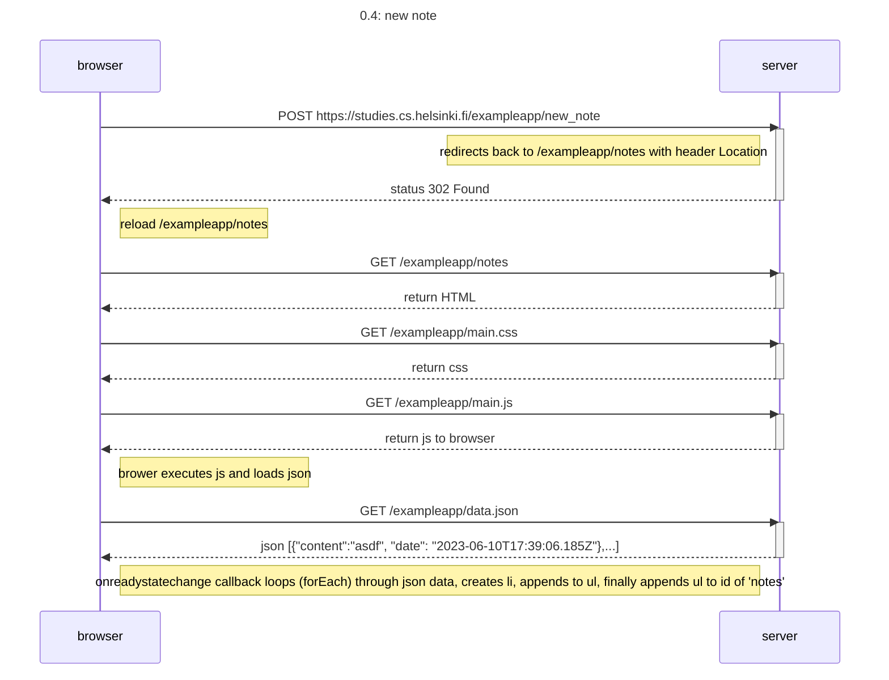

# 0.4: new note

```mermaid
sequenceDiagram
    Title: 0.4: new note
    participant browser
    participant server

    browser->>server: POST https://studies.cs.helsinki.fi/exampleapp/new_note
    activate server
    Note left of server: redirects back to /exampleapp/notes with header Location
    server-->>browser: status 302 Found
    deactivate server
    Note right of browser: reload /exampleapp/notes

    browser->>server: GET /exampleapp/notes
    activate server
    server-->>browser: return HTML
    deactivate server

    browser->>server: GET /exampleapp/main.css
    activate server
    server-->>browser: return css
    deactivate server

    browser->>server: GET /exampleapp/main.js
    activate server
    server-->>browser: return js to browser
    deactivate server

    Note right of browser: brower executes js and loads json

    browser->>server: GET /exampleapp/data.json
    activate server
    server-->>browser: json [{"content":"asdf", "date": "2023-06-10T17:39:06.185Z"},...]
    deactivate server

    Note right of browser: onreadystatechange callback loops (forEach) through json data, creates li, appends to ul, finally appends ul to id of 'notes'


```
