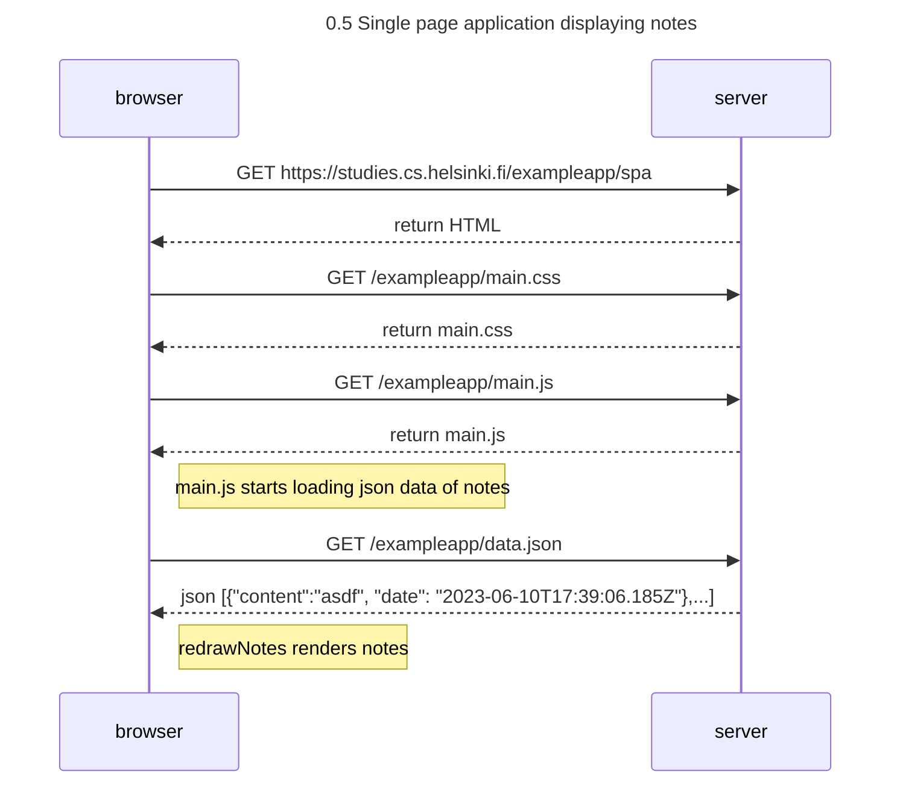

# 0.5 SPA

```mermaid
sequenceDiagram
  Title: 0.5 Single page application displaying notes

    browser->>server: GET https://studies.cs.helsinki.fi/exampleapp/spa
    server-->>browser: return HTML

    browser->>server: GET /exampleapp/main.css
    server-->>browser: return main.css

    browser->>server: GET /exampleapp/main.js
    server-->>browser: return main.js

    Note right of browser: main.js starts loading json data of notes

    browser->>server: GET /exampleapp/data.json
    server-->>browser: json [{"content":"asdf", "date": "2023-06-10T17:39:06.185Z"},...]

    Note right of browser: redrawNotes renders notes
```
